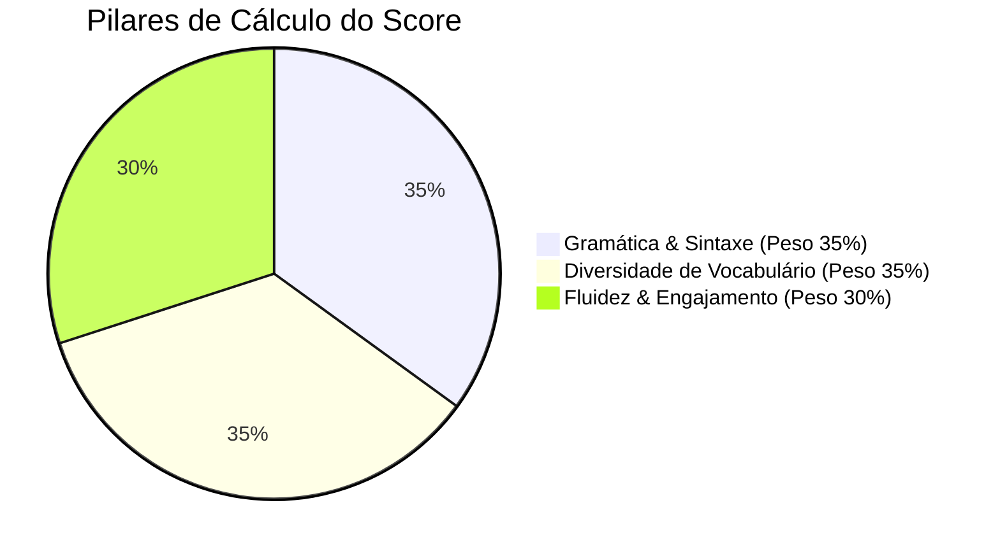

# Algoritmo de Cálculo: Score de Fluência (Fluenty)

Este documento especifica a inteligência analítica do **Fluenty**, definindo como a IA processa a conversa pós-sessão para gerar as notas de performance (0 a 100), correções e insights de vocabulário de forma rápida e escalável.

---

## 1. A Abordagem Analítica

Após o usuário clicar em "Encerrar Chamada" (ou o tempo expirar), a transcrição completa da conversa é enviada para um LLM (Gemini 1.5 Flash) configurado com um prompt do avaliador estruturado. 

A IA avalia a sessão baseando-se em três pilares principais de medição:



1.  **Gramática & Sintaxe (Peso 35%):** Mede o uso correto de tempos verbais, preposições, concordância e ordem das palavras.
2.  **Diversidade de Vocabulário (Peso 35%):** Analisa se o usuário utiliza sinônimos ricos ou se repete excessivamente palavras genéricas (ex: *good, bad, nice, things*). Avalia a maturidade lexical.
3.  **Fluidez & Engajamento (Peso 30%):** Mede o esforço de comunicação do usuário. 
    *   *Penaliza:* Respostas ultra-curtas de uma ou duas palavras (ex: *"Yes"*, *"I don't know"*).
    *   *Recompensa:* Tentativa de elaborar ideias complexas, uso de conectivos (ex: *however, on the other hand, therefore*) e phrasal verbs.

---

## 2. Estrutura do Schema de Resposta da IA (JSON)

Para garantir que o aplicativo possa ler os dados sem falhas de tipagem, a API de IA retornará obrigatoriamente um formato JSON estruturado com o seguinte schema:

```json
{
  "score_overall": 87,
  "score_grammar": 90,
  "score_vocabulary": 82,
  "score_fluency": 89,
  "corrections": [
    {
      "original": "I have gone to the mall yesterday.",
      "corrected": "I went to the mall yesterday.",
      "explanation": "Quando especificamos um momento no passado ('yesterday'), devemos usar o Simple Past ('went') em vez do Present Perfect ('have gone')."
    }
  ],
  "vocabulary_improvements": [
    {
      "word_used": "good",
      "suggestions": ["exceptional", "outstanding", "rewarding"],
      "context": "Na frase: 'My experience in the project was good...'"
    }
  ],
  "highlights": "Você demonstrou excelente desenvoltura ao falar sobre carreiras em tecnologia e usou conectivos avançados.",
  "instagram_card_phrase": "Pratiquei conversação sobre Carreiras e bati 87% de Fluência! 🚀"
}
```

---

## 3. O Prompt Base da IA Avaliadora

Abaixo está o rascunho do prompt de sistema que utilizaremos para configurar o LLM pós-sessão:

```text
Você é um avaliador de proficiência em inglês experiente e amigável.
Seu objetivo é analisar a transcrição de uma chamada de conversação entre o Usuário (USER) e a IA (AI).

ANALISE:
1. Erros gramaticais e de concordância cometidos pelo USER.
2. Repetição excessiva de vocabulários básicos e sugira alternativas mais refinadas/nativas.
3. A desenvoltura e fluidez (usuário desenvolve frases completas ou apenas respostas curtas?).

REGRAS DE NOTA (0 a 100):
- 90-100: Fluência avançada. Pouquíssimos erros, vocabulário variado, frases longas e naturais.
- 75-89: Fluência intermediária alta. Comunica-se bem, comete alguns erros gramaticais menores, vocabulário adequado mas repetitivo.
- 50-74: Fluência intermediária básica. Consegue falar, mas depende de frases simples e comete erros frequentes de tempos verbais.
- Abaixo de 50: Iniciante. Respostas de uma ou duas palavras, muita dificuldade de formular estruturas completas.

Retorne EXCLUSIVAMENTE um objeto JSON válido, sem markdown envolta, seguindo o schema especificado. As explicações de correção devem ser escritas em Português do Brasil de forma clara e motivadora.
```

---

## 4. Evitando Frustração (Efeito Motivacional)

> [!WARNING]
> **Cuidado com a auto-estima do usuário:** A primeira barreira de quem está aprendendo é a frustração. Se a IA der uma nota muito baixa (ex: 30%) logo nas primeiras sessões, o usuário pode desinstalar o app por se sentir incapaz.

*   **Gamificação Protetora:** No onboarding, definimos o nível atual do usuário (Iniciante, Intermediário, Avançado). As notas de fluidez devem ser calculadas **em relação ao nível dele**, e não a um nativo perfeito.
*   **Tom Construtivo:** A IA sempre deve destacar pelo menos um ponto positivo em `highlights` antes de listar as correções.
*   **Visual de Vitória:** Mesmo notas como 70% devem ser exibidas em cards bonitos, celebrando o tempo de prática e o progresso da consistência (streak), que é o que mais importa no início.
