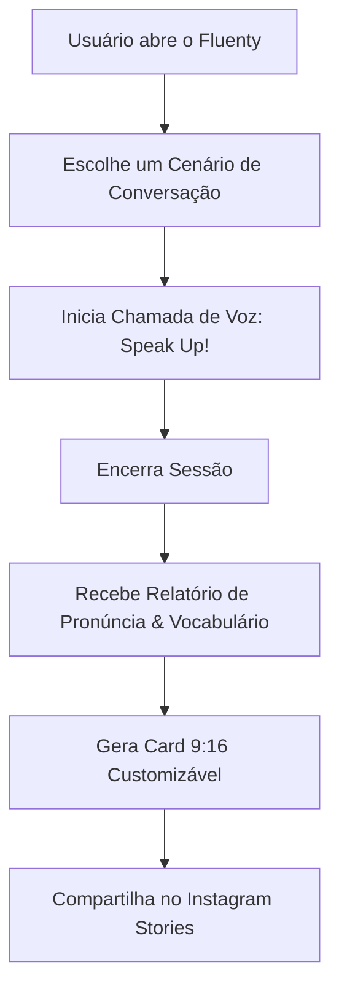

# Especificação Técnica e de Produto: Fluenty

Esta especificação define os fluxos de experiência, gamificação, arquitetura técnica e o motor de viralidade do **Fluenty**.

---

## 1. Visão Geral do Produto

O **Fluenty** é um aplicativo móvel/web de conversação de idiomas por voz impulsionado por Inteligência Artificial. Ele resolve a dor do bloqueio e do medo de falar em outro idioma, oferecendo sessões de conversação práticas, sem julgamento, com feedback instantâneo e cards estéticos gerados para compartilhamento nas redes sociais.

---

## 2. Fluxos e Telas do Aplicativo

### Tela 1: Dashboard Principal
*   **Seção de Streak (Consistência):** Exibe a sequência de dias ativos (ex: 🔥 7 dias) e o calendário de hábitos diários no estilo "heatmap" (inspirado no GitHub e WakaTime).
*   **Botão Principal de Ação:** Um botão proeminente e animado com o texto **"Speak Up!"** para iniciar a prática de conversação rápida.
*   **Biblioteca de Cenários (Roleplays):**
    *   *Casual Talk:* Conversa livre e sem roteiro.
    *   *Job Interview:* Preparação e simulação de entrevista de emprego.
    *   *Travel Helper:* Situações de viagem (aeroporto, restaurante, hotel).
    *   *Business Meeting:* Simulação de reuniões e apresentações profissionais.

### Tela 2: Interface de Chamada de Voz (Voice Interface)
*   **Ondas Sonoras Dinâmicas:** Interface baseada em animações CSS suaves que reagem em tempo real à fala do usuário e à fala da IA.
*   **Tradução Instantânea / SOS:** Um botão de suporte para sugerir palavras ou traduzir frases caso o usuário trave durante a conversa.
*   **Configuração de Legendas:** Permite ativar ou desativar a transcrição em tempo real na tela.

### Tela 3: Relatório de Performance (Feedback Loop)
*   **Score de Fluência:** Uma pontuação de 0 a 100 baseada na pronúncia, gramática e riqueza de vocabulário.
*   **IA Insights:** Sugestões práticas de como melhorar a construção de frases e vocabulários alternativos para soar mais natural.
*   **Compartilhar Progresso:** Botão para abrir o editor de cartões para redes sociais.

---

## 3. O Motor de Viralidade (Instagramable Cards)

O compartilhamento nos Stories do Instagram é o principal motor de crescimento orgânico do Fluenty. Ao finalizar uma prática, o usuário pode gerar e exportar um cartão visual nos seguintes moldes:

*   **Formato de Saída:** 9:16 nativo (1080x1920px), pronto para publicação direta nos Stories.
*   **Dados Exibidos:** Tempo total praticado, Score de Fluência (ex: 94%), novos termos dominados, streak acumulado e o tema do cenário praticado (ex: *"Pratiquei Business English no Fluenty"*).
*   **Temas Estéticos Customizáveis:**
    *   *Minimalist:* Fundo claro ou cinza-fóssil com tipografia serifada e estilo editorial elegante (estilo Pinterest).
    *   *Dark Aurora:* Tons escuros com luzes neon difusas ao fundo.
    *   *Glassmorphism:* Sobreposição translúcida com visual fosco elegante.

---

## 4. Arquitetura Técnica Recomendada

A stack do Fluenty visa performance, velocidade de resposta (baixa latência de áudio) e facilidade de manutenção:

*   **Front-end:** Next.js (React) + TailwindCSS, otimizado para Web App Responsivo e Mobile-friendly.
*   **Back-end & Banco de Dados:** Supabase (PostgreSQL) para autenticação, banco de dados (histórico de conversas, perfis, streaks) e Edge Functions.
*   **Processamento de Voz & IA:**
    *   *Transmissão de Áudio:* OpenAI Realtime API ou Gemini Multimodal Live API para conversação de áudio bidirecional com latência ultra-baixa (menor que 500ms).
    *   *Análise Pós-Sessão:* Um LLM estruturado para analisar a transcrição da conversa e pontuar a pronúncia e gramática.
